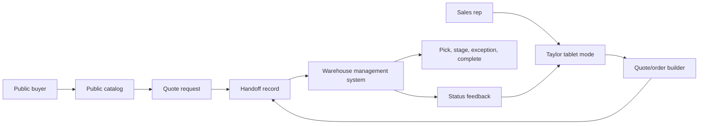

# Pioneer System Map

This document maps the Pioneer three-part system: public catalog, Taylor tablet mode, and WMS. It is implementation-ready design guidance for teams planning screens, data contracts, and handoffs. It does not require app code changes by itself.

## System Overview



The catalog and tablet systems create demand signals. The WMS receives operational work. Status can flow back to tablet mode for rep visibility, but WMS actions should remain owned by warehouse users.

## Surface Responsibilities

| Surface | Primary User | Core Job | Owns | Must Not Own |
| --- | --- | --- | --- | --- |
| Public catalog | Public buyer | Browse products and request quote | Category browse, product detail, quote cart, request form, public confirmation | Customer accounts, negotiated pricing, rep notes, warehouse task execution |
| Taylor tablet mode | Sales rep | Guide customer conversation and prepare quote/order | Selected customer, recommendations, field lookup, quote/order builder, handoff preview | Public anonymous browsing, WMS execution, hidden account state |
| WMS | Warehouse/operator | Fulfill or resolve handoff work | Queue, line-item picking, bin/location, status, exceptions, completion | Sales recommendations, public quote UX, customer-facing marketing |

## Core Objects

### Product

The Product object is shared across all three systems.

Required fields:

| Field | Type | Notes |
| --- | --- | --- |
| `product_id` | string | Stable internal demo or production identifier. |
| `sku` | string | Primary operational product identifier. |
| `name` | string | Human-readable product name. |
| `category` | string | Top-level product category. |
| `product_type` | string | More specific grouping when available. |
| `manufacturer_part_number` | string/null | Show when available. |
| `description` | string/null | Practical product detail, not marketing filler. |
| `image_ref` | string/null | Local asset or approved remote reference. |
| `stock_status` | enum | `in_stock`, `low_stock`, `lead_time`, `quote_required`, `unavailable`, `unknown`. |
| `stock_quantity` | number/null | WMS and internal contexts only unless approved public demo field. |
| `lead_time` | string/null | Human-readable lead-time context. |
| `bin_location` | string/null | Operational location. Public display is optional; WMS display is required when available. |

Design rule: Product data can be displayed differently by surface, but the SKU, name, category, and availability meaning must remain consistent.

### Customer

Customer data belongs to tablet mode and approved internal workflows only.

Required fields for demo tablet mode:

| Field | Type | Notes |
| --- | --- | --- |
| `customer_id` | string | Stable demo identifier. |
| `customer_name` | string | Visible selected-customer label. |
| `account_type` | string/null | Optional grouping for demo context. |
| `preferred_categories` | list/string | Drives recommendations. |
| `notes` | string/null | Rep-facing demo notes. |
| `quote_history_summary` | string/null | Placeholder summary only unless approved data exists. |

Design rule: Customer data must never appear in the public catalog unless the product direction changes explicitly and authentication/account boundaries are implemented.

### Quote Cart

Quote Cart exists in public catalog and tablet mode, with different context.

Required fields:

| Field | Type | Notes |
| --- | --- | --- |
| `cart_id` | string | Local/session or persistent identifier. |
| `source_surface` | enum | `public_catalog` or `tablet_mode`. |
| `customer_id` | string/null | Null for public catalog. Required when tablet quote is customer-specific. |
| `lines` | list | One or more quote/order lines. |
| `contact` | object/null | Public quote contact fields. |
| `notes` | string/null | Customer/request or rep notes. |
| `status` | enum | `draft`, `submitted`, `ready_for_handoff`, `sent_to_wms`. |

Quote/order line fields:

| Field | Type | Notes |
| --- | --- | --- |
| `line_id` | string | Stable line identifier. |
| `product_id` | string | Links to Product. |
| `sku` | string | Copied for operational readability. |
| `name` | string | Copied for review. |
| `quantity` | number | Required, positive. |
| `availability_note` | string/null | Snapshot at time of quote/order. |
| `line_note` | string/null | Optional request, substitution, or customer context. |

Design rule: A quote cart is not a final order unless the surface and status explicitly say so.

### Handoff Record

The Handoff Record is the bridge from catalog/tablet to WMS.

Required fields:

| Field | Type | Notes |
| --- | --- | --- |
| `handoff_id` | string | Stable reference. |
| `source_surface` | enum | `public_catalog` or `tablet_mode`. |
| `source_reference` | string | Quote request ID, quote/order ID, or cart ID. |
| `customer_id` | string/null | Null for public request unless approved account link exists. |
| `customer_display_name` | string/null | Tablet/internal only. |
| `contact_summary` | object/null | Public request contact summary. |
| `lines` | list | Product, SKU, quantity, availability snapshot, notes. |
| `requested_by` | string/null | Rep name, public contact, or system. |
| `created_at` | datetime | Required. |
| `status` | enum | `new`, `reviewing`, `picking`, `partially_available`, `staged`, `exception`, `complete`, `cancelled`. |
| `priority` | enum/null | `standard`, `rush`, `hold_for_review`, or null. |
| `handoff_notes` | string/null | Operational notes, not sales flourish. |

Design rule: The handoff is the point where customer/sales intent becomes warehouse work. It must preserve enough context to act without exposing unnecessary sales UI.

### Warehouse Task

Warehouse Task is WMS-owned.

Required fields:

| Field | Type | Notes |
| --- | --- | --- |
| `task_id` | string | Stable task identifier. |
| `handoff_id` | string | Links to Handoff Record. |
| `line_id` | string | Links to line item. |
| `sku` | string | Required. |
| `quantity_requested` | number | Required. |
| `quantity_available` | number/null | Required when inventory is known. |
| `quantity_picked` | number | Defaults to zero. |
| `bin_location` | string/null | Required when known. |
| `status` | enum | `pending`, `picking`, `picked`, `short`, `staged`, `blocked`, `complete`. |
| `exception_reason` | string/null | Required when status is `short` or `blocked`. |
| `updated_at` | datetime | Required. |

Design rule: WMS status should be auditable and operational. Avoid ambiguous state names.

## Primary User Journeys

### Journey 1: Public Catalog to Quote Request

1. Buyer opens public catalog.
2. Buyer browses by category or searches by product name, SKU, part number, or product type.
3. Buyer opens product detail and reviews stock/lead-time context.
4. Buyer adds one or more items to quote cart.
5. Buyer edits quantities and submits request.
6. System creates a quote request reference.
7. Internal workflow may convert request into a handoff record for review or warehouse visibility.

Required UI behaviors:

- Public catalog must remain account-free.
- Quote confirmation must clarify Pioneer will confirm final pricing and availability.
- Quote request should not imply an item has been reserved unless reservation logic exists.

### Journey 2: Tablet Guided Selling to Handoff Preview

1. Rep opens Taylor tablet mode.
2. Rep selects or confirms demo customer.
3. Tablet shows customer context: notes, preferred categories, recommendations, or relevant history placeholders.
4. Rep searches products or adds recommended items.
5. Rep builds quote/order with quantities and optional notes.
6. Rep previews warehouse handoff.
7. Rep marks the quote/order ready for internal review or future WMS handoff.

Required UI behaviors:

- Selected customer must stay visible.
- Recommendations must have a reason.
- Quantity edit must be fast and touch-friendly.
- Handoff preview must show line items, quantities, SKU, stock/lead-time, and notes.

### Journey 3: WMS Fulfillment

1. Operator opens WMS queue.
2. Operator reviews new or active handoff records.
3. Operator opens a handoff and reviews line items.
4. Operator picks, stages, flags short stock, or blocks a line with reason.
5. WMS updates handoff status.
6. Status can be visible to tablet/internal review.

Required UI behaviors:

- Queue must show status and source reference.
- Line items must show SKU, quantity requested, quantity available, bin/location, and line status.
- Exceptions must require a reason and a next action.
- Completed work must remain reviewable.

## Handoff Contract

Any future implementation that sends work to WMS should produce this minimum JSON shape:

```json
{
  "handoff_id": "HND-000123",
  "source_surface": "tablet_mode",
  "source_reference": "QTE-000456",
  "customer_id": "CUST-DEMO-001",
  "customer_display_name": "Demo Customer",
  "created_at": "2026-06-28T14:30:00-04:00",
  "status": "new",
  "priority": "standard",
  "handoff_notes": "Confirm lead time on low-stock lines before delivery promise.",
  "lines": [
    {
      "line_id": "LINE-001",
      "product_id": "PROD-0001",
      "sku": "PIS-0001",
      "name": "Cut Resistant Nitrile Work Gloves",
      "quantity": 12,
      "availability_note": "In stock",
      "bin_location": "A-01-04",
      "line_note": "Customer requested large size if available."
    }
  ]
}
```

Validation rules:

- `handoff_id`, `source_surface`, `source_reference`, `created_at`, `status`, and `lines` are required.
- `lines` must contain at least one item.
- Every line must include `line_id`, `product_id`, `sku`, `name`, and `quantity`.
- `quantity` must be a positive number.
- `source_surface` must be one of `public_catalog` or `tablet_mode`.
- `customer_id` must be null for unauthenticated public quote requests.
- `status` must use the shared handoff status list.

## Status Model

### Handoff Status

| Status | Meaning | Owner |
| --- | --- | --- |
| `new` | Handoff created and not yet reviewed. | System/WMS |
| `reviewing` | Internal or warehouse review in progress. | WMS/internal |
| `picking` | Warehouse is actively picking one or more lines. | WMS |
| `partially_available` | At least one line cannot be fulfilled as requested. | WMS |
| `staged` | Items are picked and staged for next step. | WMS |
| `exception` | Work is blocked and needs resolution. | WMS/internal |
| `complete` | Fulfillment workflow is complete. | WMS |
| `cancelled` | Handoff is no longer active. | Internal/WMS |

### Line Status

| Status | Meaning |
| --- | --- |
| `pending` | Not started. |
| `picking` | Being picked. |
| `picked` | Picked but not staged. |
| `short` | Not enough available quantity. |
| `staged` | Ready for next fulfillment step. |
| `blocked` | Cannot proceed without resolution. |
| `complete` | Line is complete. |

Design rule: Status labels in UI may be title case, but underlying values should remain stable.

## Data Boundary Rules

### Public Catalog

Allowed:

- Product name, category, type, SKU, manufacturer part number.
- Product image if approved.
- General stock/lead-time context.
- Quote request form fields.
- Public confirmation ID.

Not allowed:

- Customer names or selectors.
- Customer notes.
- Negotiated pricing.
- Quote history tied to customer accounts.
- Warehouse task controls.
- Internal-only file paths or scripts.

### Tablet Mode

Allowed:

- Demo customer selector.
- Customer notes and preferred categories.
- Recommendations.
- Quote/order builder.
- Warehouse handoff preview.
- Internal availability context.

Not allowed:

- Unapproved real customer data.
- Public anonymous assumptions when selected customer context is active.
- Actual WMS inventory mutation unless the workflow has explicit implementation and permissions.

### WMS

Allowed:

- Handoff queue.
- Line-level SKU, quantity, bin/location, status, and exceptions.
- Operational notes.
- Completion and exception actions.

Not allowed:

- Customer-facing sales copy.
- Decorative product browsing.
- Unclear inventory-changing actions.
- Exposure of private sales notes unless needed for fulfillment and approved.

## Screen Inventory

### Public Catalog Screens

| Screen | Required Content | Primary Action |
| --- | --- | --- |
| Home/catalog entry | Category overview, search or browse path, public framing | Browse products |
| Product catalog | Filters, product list/cards, availability context | View details / Add to quote |
| Product detail | Image, identifiers, description, stock/lead time, related context | Add to quote |
| Quote cart | Lines, quantities, remove/update, request path | Request quote |
| Request quote | Contact/request fields, line summary, caveat copy | Submit request |
| Confirmation | Reference ID, next-step explanation | Return to catalog |

### Tablet Mode Screens

| Screen | Required Content | Primary Action |
| --- | --- | --- |
| Customer select | Customer list/search, account summary | Select customer |
| Customer dashboard | Selected customer, notes, preferred categories, recommended products | Add recommended item |
| Product lookup | Search, filters, field-friendly product results | Add to order |
| Quote/order builder | Lines, quantities, notes, availability context | Preview handoff |
| Handoff preview | Source, customer, lines, statuses, notes | Mark ready / send when implemented |

### WMS Screens

| Screen | Required Content | Primary Action |
| --- | --- | --- |
| Queue | Handoff references, source, status, priority, line count | Open handoff |
| Handoff detail | Header context, line table, notes, status | Start/review work |
| Pick line view | SKU, product, requested qty, available qty, bin/location | Mark picked / flag issue |
| Exception panel | Reason, owner, next action, affected lines | Resolve or escalate |
| Completion view | Completed lines, remaining issues, audit summary | Close handoff |

## Implementation Notes

- Keep shared status values centralized when code is added.
- Keep public and tablet routes/entrypoints visibly separate.
- Treat WMS as a separate operating mode even if implemented in the same Streamlit repo for demo purposes.
- Use generated or approved demo data only.
- Keep image attribution and photo review state visible to developers, not public users.
- Design for long product names, missing images, unavailable stock, and partial fulfillment.
- Add test data for at least: empty cart, low stock, lead time, missing image, multiple quote lines, customer recommendation, WMS exception, and partial availability.

## Review Questions

Before approving a feature, ask:

- Which surface owns this behavior?
- Which user is it for?
- What object is being created or changed?
- Does this expose data outside its allowed boundary?
- Does the handoff preserve SKU, quantity, source, status, and notes?
- Can the next person in the pipeline act without guessing?
- Does the UI look like Pioneer: practical, premium, industrial, and calm?
